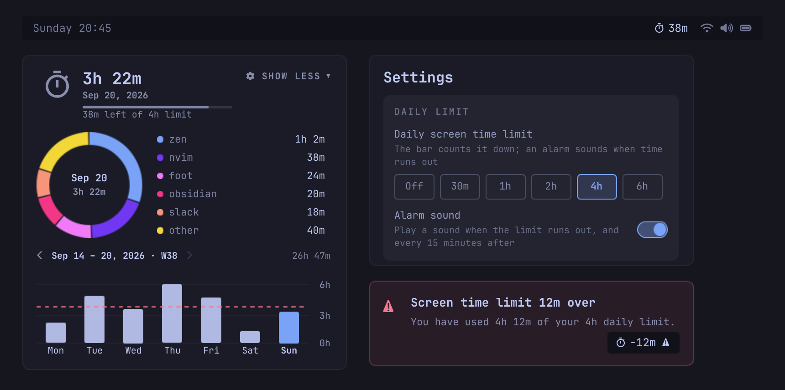

<p align="center">
  
</p>
<p align="center">
  <sub>Bar, panel, settings and alarm as they render; the week and app
  figures are sample data.</sub>
</p>

# Screen Limit

Decide when to stop. Set a daily screen time limit and the bar counts it down
as you work, warns you the moment it runs out, and keeps alarming until you
walk away. Underneath it is a full tracker: focused time per app, a donut
chart, a 52-week trend and a yearly overview — terminal-aware,
keyboard-first, fully local.

A fork of [Screen Time](https://github.com/ax1g/quickshell-screentime-plugin)
by agx, which does everything below except the limit. That project's daily
*goal* — something to reach — is replaced here by a daily *limit* —
something to stay under.

## Features

- Daily limit: pick Off/30m/1h/2h/4h/6h in settings and the bar
  counts down — `1h 23m` left, then `-12m` with a ⚠ once you run past it.
  A progress bar under the hero total turns urgent there too, and the
  limit you set today never rewrites yesterday's.
- Alarm: a critical notification and the system alarm chime the moment the
  limit runs out, repeated every 15 minutes for as long as you stay over,
  silent again at midnight. Locked and idle sessions stay quiet, and the
  sound has an off switch that keeps the notification.
- Two opt-in ways to make an ignored limit harder to ignore, both in
  Settings under the limit itself:
  - **Escalating alarm** — the quarter-hour nag tightens to 10, 5 and
    then 3 minutes as the hours over add up, and stops there.
  - **Drain the color** — the desktop goes grayscale while you are over,
    through Hyprland's `screen_shader`. It paints at composite time, so
    screenshots and screen shares keep their color; only the glass in
    front of you goes gray. It never touches the option if a theme
    already set one, and clears only its own. If a shell ever dies while
    the screen is gray, the next one clears it — or you can:
    `hyprctl eval "hl.config({ decoration = { screen_shader = '' } })"`.
- Settings lock: set a password and the gear asks for it before the
  limit, the alarm or your history can be touched. The panel itself stays
  open — your own numbers are never hidden from you. An unlock ends when
  the panel closes, and wrong guesses cost a pause that doubles. See
  [What the lock is](#what-the-lock-is) before trusting it with anything.
- Live bar widget: with no limit set it is today's running total, in your
  bar font, updated as you work. Right-click collapses it to a single
  glyph; remembered.
- Per-app tracking: idle, locked, suspend and desktop time never counted. A
  focused terminal shows what runs inside it (`opencode`, not `foot`),
  re-resolved live; `steam_app_123456` becomes the game title from local
  Steam metadata. Reverse-DNS IDs shortened; Chromium web apps fold by
  hostname across profiles.
- Games count too: whatever you play — Steam, Battle.net, browser, emulator —
  gets timed like any other app. It's focused time, so an evening of being
  AFK in a lobby won't inflate your hours the way Steam's counter does.
- Donut chart: six biggest apps + "Other", day total in the centre. Hover a
  slice or legend row to spotlight that app; Show More expands the full
  scrollable list.
- 52-week trend: paginated Mon–Sun pages with date-range headers
  (`Aug 31 – Sep 6, 2026 · W36`); click any day to inspect it, click again
  for today. A dashed line marks your limit, so the days that crossed it
  stand out. Header total flips between time and share of the week's
  168 hours.
- Yearly overview: per-month bars across every recorded year, plus a
  Wrapped-style retro — day counts, longest streak and break, top months,
  busiest Mon–Sun week, weekday rhythm, peak day.
- Usage patterns: top app, vs yesterday, and busiest day of the week you're
  looking at. Insight and retro colours follow your theme.
- Configurable: the gear next to SHOW MORE opens sectioned prefs that
  persist — set the daily limit and mute its alarm sound, hide the yearly
  overview or insights, set the weekly graph to
  12/24/36/52 weeks, rename apps and ignore the noisy ones, see the
  storage footprint and the totals that never expire, recolor the hero
  icons from theme swatches, mute the playful extras,
  triple-confirmed reset today (archives untouched), or four-click wipe
  everything (no undo).
- Keyboard-first: the panel opens, closes, scrolls and triggers every
  control from the keyboard — see [Keybinds & hints](#keybinds--hints)
  below. Summon and control the panel via the `mikwat.screen-limit` IPC
  target (`open`, `toggle`, `resetToday`, `resetAll`, `status`).
- Private by design: one local JSON file; old days roll into a
  perpetual per-day archive, and only the app breakdown is ever forgotten.
- Timer easter egg: turns a full circle on the hour; gold sparkles on
  hover; header icons spin as you navigate (mute it all with Playful
  extras).

## What the lock is

A speed bump between an impulse and a raised limit. Nothing more, and the
README would rather say so than let you find out later:

- The password is never stored. What lands in `shell.json` is a salted,
  iterated SHA-256 digest, and the plain text never reaches a log or a
  process argument.
- That file is yours to edit. Deleting the `settingsPassword` key unlocks
  the settings, which is both the recovery path when you forget it and the
  reason this cannot stop a determined you.
- The plugin can be disabled from the bar's own menu, and
  `quickshell ipc call mikwat.screen-limit resetToday` still works while
  the settings are locked. Neither route is gated.
- The work factor is small on purpose: hashing runs on the shell's GUI
  thread, so a heavier one would freeze your bar to buy protection that
  the two points above already give away.

It works because a few seconds of friction is usually all that stands
between you and "just this once" — not because it is a vault.

## Keybinds & hints

The panel is keyboard-first, and `f` is the only key you need to
remember: press it and every pressable gets a key badge. Type the
badge to trigger that control — single letters on the home panel (`y`
yearly, `c` settings, `m` more, `b`/`n` week pages, `t` week total,
`1`–`7` days), `b`/`n` to move between years in the yearly view, and
two-letter tags on the settings menu. The badges disappear on any other
press.

Everything else is standard: `j`/`↓` and `k`/`↑` scroll, `Esc` exits
first hint mode then the panel, `Tab`/`Shift+Tab` move between bar
panels, `p` expands Show More, and the wheel scrolls any overflowing
list.

## Install

```bash
omarchy plugin add https://github.com/mikwat/quickshell-screenlimit-plugin.git
omarchy plugin enable mikwat.screen-limit
```

`omarchy plugin add` clones from anywhere git can reach, so a local
checkout works too — hand it a path instead of the URL.

Requires Omarchy and Hyprland. A Nerd Font provides the glyphs, and
`python3` (preinstalled on Omarchy) powers terminal and Steam name
resolution — without it the plugin still tracks, but terminals show under
their own name (`foot`, `kitty`) instead of what runs inside them.

The alarm notifies through `notify-send` and plays through the first of
`canberra-gtk-play`, `paplay` or `pw-play` it finds, all preinstalled on
Omarchy. Missing any of them costs you that half of the alarm and nothing
else — the countdown and the ⚠ badge never depend on them.

## Uninstall

```bash
omarchy plugin disable mikwat.screen-limit
omarchy plugin remove mikwat.screen-limit
```

To also delete the history file:

```bash
rm ~/.config/omarchy/screen-limit/history.json
```

## Data

Everything lives in one local file, `~/.config/omarchy/screen-limit/history.json`:

```json
{
  "days": {
    "2026-08-16": { "total": 490875, "apps": { "zen": 313349, "opencode": 148706 } }
  },
  "months": {
    "2026-07": 9823400
  },
  "years": {
    "2026": { "2026-08-15": 582190 }
  }
}
```

- Per-app focus time in milliseconds, keyed by day (`YYYY-MM-DD`).
- A session spanning midnight splits there, so each day keeps its own
  seconds.
- Per-app detail is kept for a full year, always covering the chosen
  weekly graph. As days age past it, each one's total folds into an
  ever-growing per-day archive in `"years"` — day counts, streaks, peak
  days, top months, insights and every yearly total are derived from it
  forever, so every recorded year stays browsable for as long as the
  file exists. Only the app breakdown is ever forgotten.
- `months` only appears in files written by older versions: current
  writes persist `days` and `years`, and readers keep honoring any
  legacy month lumps.
- The Wipe-all control in Settings, or deleting the file, is the only
  way to lose history.

## Development

The shell hot-reloads the plugin whenever a file changes, so a symlink into
your checkout is all you need to iterate:

```bash
ln -s "$PWD" ~/.config/omarchy/plugins/mikwat.screen-limit
node --check js/Model.js && node --check js/State.js && node --check js/Password.js
npx -y prettier@3.9.6 --no-semi --check js/ tests/
node --test tests/model.test.js tests/state.test.js tests/service.test.js tests/panel.test.js tests/password.test.js
ruff check python/ tests/ && ruff format --check python/ tests/
python3 -m unittest discover -s tests
qmllint -I lint qml/*.qml qml/components/*.qml
./tests/geometry/run.sh
```

The same checks run in CI on every push. See CONTRIBUTING.md for the
project structure and QML rules.

## License

MIT
